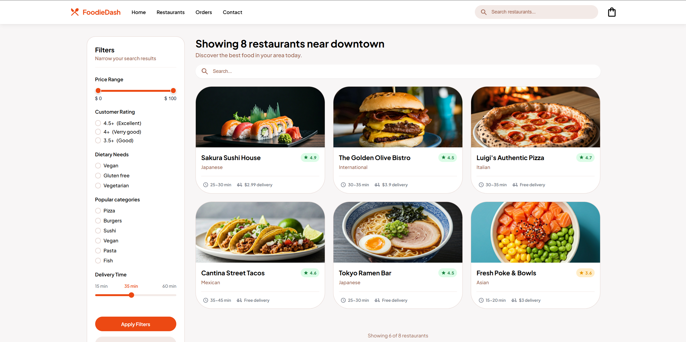
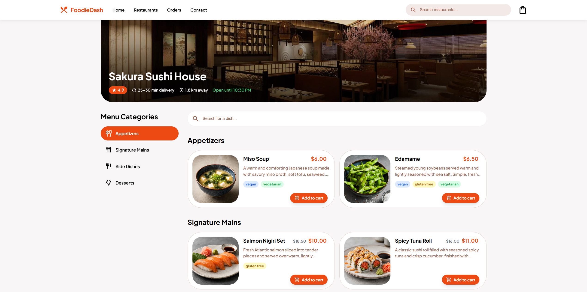

# Food delivery app

A food delivery web app where people can search for restaurants and order the food they like. They can also filter restaurants by their preferred categories, price, dietary needs, customer rating and delivery time.
<br>

## Step 1: Install dependencies

```sh
npm install
```

## Step 3: Start the json-server

```sh
npm run server
```

## Step 2: Start the project

```sh
npm start
```

<br>





